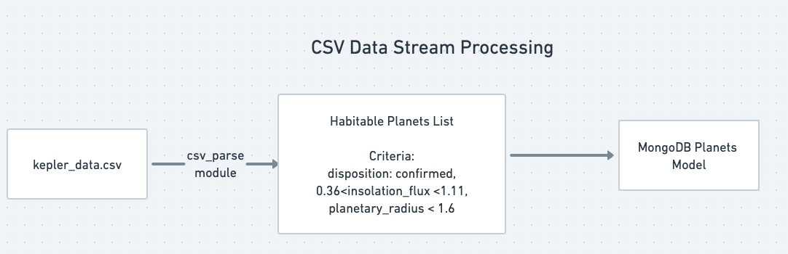

# Nasa Exoplanet Flights

A React + Node project to determine habitable exoplanets and allow a user to schedule a flight to them. An exoplanet is a planet outside the earth’s solar system with conditions favorable to life.

# TO DO

1. Add routes for the backend
2. Add schema definition for database

## Functional Requirements

1. A user can get a list of habitable exoplanets
2. A user can schedule a launch to a habitable exoplanet
3. A user can update or delete an existing launch
4. A user can view the launch history

## Front End (nasa-fe)

The React user interface allows the user to schedule launches to habitable exoplanets, view upcoming launches, and see a history of past launches. The Arwes SCI FI UI library adds animation, backgrounds, a color scheme and sounds to the UI components. On startup, the client gets a list of habitable exoplanets from the server that is displayed for scheduling launches. The Upcoming Launches window displays the launches that were successfully scheduled. The History window displays launches that have occurred in the past.

## Back End (nasa-project-api)

The application server uses Node.js to respond to HTTP requests from
the client to schedule launches, modify and delete them. On start up,
the server reads a CSV file containing planetary data to create a list of
habitable planets that it sends to the React front end. This list of planets is also stored in a MongoDB collection. The server also stores launches in a MongoDB collection. A Mongoose schema validates the data before storing it.

## Planetary Data Background

The Kepler space telescope collected data for 9 years beginning in 2009.
NASA has made a catalog of the planets and stars discovered. A planet is
considered habitable if it resembles Earth in terms of size, and
receives a sufficient amount of light.

# Core Components of the Software

## React Front End

React provides the front-end components for the application. The main pages include: Schedule a Launch, Upcoming Launches and Launch History

### Custom Hooks

UseLaunches(): a custom hook that saves a list of launches, gets previously saved launches from the backend, submits new launches to the server, and aborts launches.

UsePlanets(): a custome hook to get the list of habitable planets from the server

### arwes SCI-FI library

The arwes library provides a SCI-FI component library for the user interface that includes, sounds, a color scheme and animation.

# Planetary Data

## kepler_data.csv

This CSV file contains planetary data for objects detected by the telescope. We create a readable stream with the fs module to read the file's contents line by line. The 'data' event notifies our application when a chunk of data has been read from the file.

## csv-parse module

The stream of data from the CSV file is piped into the csv-parse module's parse() function. The parse() function takes a row of comma separated data and creates an object using the column names as keys. If the planet is habitable, it is stored in the MongoDB Planet collection.

## MongoDb Database

### Planet Collection

Data for each habitable exoplanet is stored in the Planets collection. The values for the planetary radius, disposition property and insolation_flux (amount of light received) are the criteria used to determine if a planet is habitable. Exoplanets meeting the criteria are added to the Planet collection.

### Launch Collection

The flights scheduled by a user are stored in the Launch collection.

## Additional Info

KOI: Kepler Objects of Interest (See KOI Table Cumulative List)
https://exoplanetarchive.ipac.caltech.edu/cgi-bin/TblView/nph-tblView?app=ExoTbls&config=cumulative
https://exoplanetarchive.ipac.caltech.edu/docs/API_kepcandidate_columns.html
