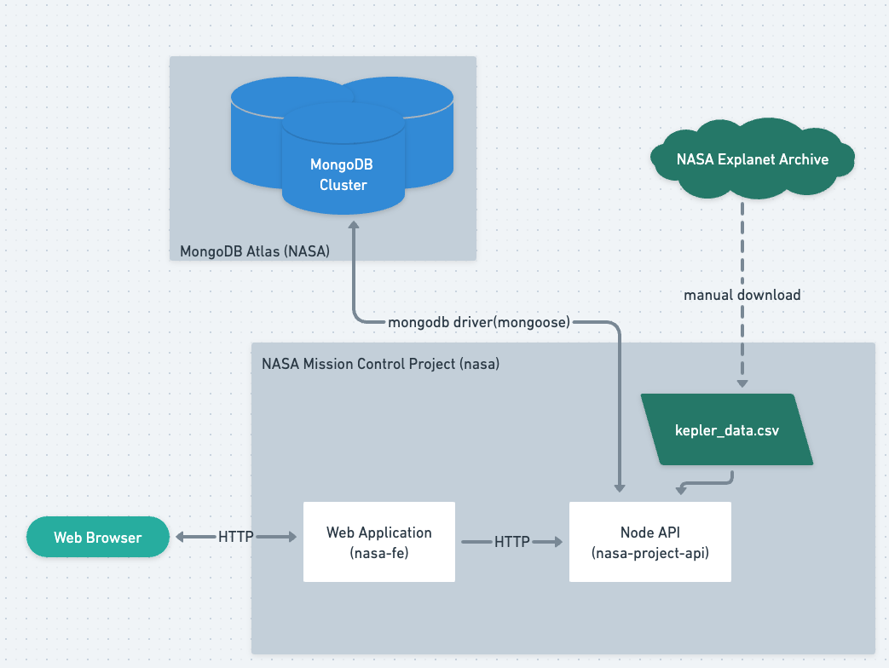

# Nasa Exoplanet Flights

A React + Node project to determine habitable exoplanets and allow a user to schedule a flight to them. An exoplanet is a planet outside the earth’s solar system with conditions favorable to life.

## Functional Requirements

1. A user can get a list of habitable exoplanets
2. A user can schedule a launch to a habitable exoplanet
3. A user can update or delete an existing launch
4. A user can view the launch history

## Planetary Data Background

The Kepler space telescope collected data for 9 years beginning in 2009.
NASA has made a catalog of the planets and stars discovered. A planet is
considered habitable if it resembles Earth in terms of size, and
receives a sufficient amount of light.

## Front End (nasa-fe)

The React user interface allows the user to schedule launches to habitable exoplanets, view upcoming launches, and see a history of past launches. The Arwes SCI FI UI library adds animation, backgrounds, a color scheme and sounds to the UI components. On startup, the client gets a list of habitable exoplanets from the server that is displayed for scheduling launches. The Upcoming Launches window displays the launches that were successfully scheduled. The History window displays launches that have occurred in the past.

## Back End (nasa-project-api)

The application server uses Node.js to respond to HTTP requests from
the client to schedule launches, modify and delete them. On start up,
the server reads a CSV file containing planetary data to create a list of
habitable planets that it sends to the React front end. This list of planets is also stored in a MongoDB collection. The server also stores launches in a MongoDB collection. A Mongoose schema validates the data before storing it.

# Model View Controller Architecture

The data for the application consists of habitable planets and flight launch information. The Model layer for the software provides functions to access the planet and launch data in server/src/models/planets.model.js and server/src/models/launches.model.js. This model layer hides the lower level implementation details used to interact with the MongoDB database collection allowing us to easily change databases in the future.

The Controller software in the server implements the endpoints for the planets and launches and their corresponding HTTP methods. The Contoller interacts with the model layer to store and retrieve data in the database.

- GET /planets/
  - Allows the user to get the list of habitable planets
- GET /launches/
  - Allows the user the get the list of scheduled launches
- POST /launches/
  - Allows the user to schedule a new launch
- DELETE /launches/:id
  - Allows the user to delete an existing launch

The Controller sends planet and launch data to the front-end View component so that it can be displayed to the user. When the user interacts with the application, the View sends requests to schedule or delete launches to the Controller and displays responses it receives for those operations.

# Core Components of the Software

## React Front End

React provides the front-end components for the application. The main pages include: Schedule a Launch, Upcoming Launches and Launch History

### Custom Hooks

UseLaunches(): a custom hook that saves a list of launches, gets previously saved launches from the backend, submits new launches to the server, and aborts launches.

UsePlanets(): a custome hook to get the list of habitable planets from the server

### arwes SCI-FI library

The arwes library provides a SCI-FI component library for the user interface that includes, sounds, a color scheme and animation.

## Express Server

### Routing Middleware on Server Side

The express.Router middleware handles routes for the planets and launches endpoints. For example, to display the list of planets the client issues a get request to the /planets route. The Planets router middleware receives the request and forwards it to the Planets.Controller which uses the Planets.Model to query the MongoDB collection and retrieve the list of planets. The result is then sent back to the client in an HTTP response.

# Planetary Data

## kepler_data.csv

This CSV file contains planetary data for objects detected by the telescope. We create a readable stream with the fs module to read the file's contents line by line. The 'data' event notifies our application when a chunk of data has been read from the file.

## csv-parse module

The stream of data from the CSV file is piped into the csv-parse module's parse() function. The parse() function takes a row of comma separated data and creates an object using the column names as keys. If the planet is habitable, it is stored in the MongoDB Planet collection.

## MongoDb Atlas Database Cluster

The database for the application is deployed with MongoDB Atlas. MongoDB Atlas deploys the application database to a cluster on the cloud providing high availability, scalability, built-in replication and auto-sharding.

### Planet Collection

Data for each habitable exoplanet is stored in the Planets collection. The values for the planetary radius, disposition property and insolation_flux (amount of light received) are the criteria used to determine if a planet is habitable. Exoplanets meeting the criteria are added to the Planet collection. The schema for the planet collection is located in server/src/models/planets.mongo.js

### Launch Collection

The flights scheduled by a user are stored in the Launch collection. The schema for the launch collection is located in server/src/models/launches.mongo.js.
The launch target value comes from the Planet collection. Rather than reference the planet from the Planet collection, the exoplanet's name is embedded into the Launch collection to keep the data for a launch in one document. However we need to perform referential integrity manually since MongoDB doesn't enforce referentially integrity automatically. The launches model verifies that each launch target matches a kepler planet name from the planets collection.

## Logging on server side

The application uses morgan as an HTTP request logger to log requests in a standard Apache output format using the "combined" predefined format in development mode.

# Improvements

1. Set a timer for launch requests; if a response doesn't arrive we can provide an appropriate error message.

## Additional Info

KOI: Kepler Objects of Interest (See KOI Table Cumulative List)
https://exoplanetarchive.ipac.caltech.edu/cgi-bin/TblView/nph-tblView?app=ExoTbls&config=cumulative
https://exoplanetarchive.ipac.caltech.edu/docs/API_kepcandidate_columns.html
